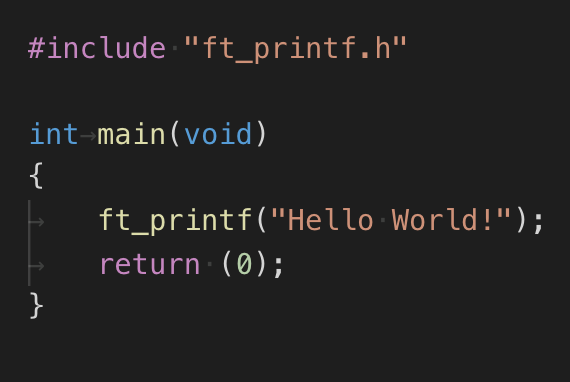

# FT_PRINTF

Everybody knows printf, the function we first encounter when we are introduced to programming and try to display "Hello World!", in any language you use.

This project consists in recoding a different version of the famous printf function in C.

It handles the "cspdiuxX" conversions and "0-[1st*][width].[2nd*][precision]" flags.

